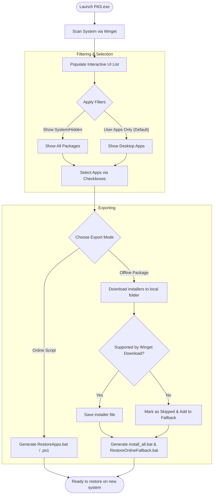

# PAS (Portable App Sync) — Comprehensive User Guide

Welcome to the comprehensive user guide for **PAS (Portable App Sync)**! This guide will walk you through the inner workings of the application, help you understand the backup and restore processes, explain the filter systems, and show you how to resolve common troubleshooting scenarios.

## Application Workflow

The diagram below outlines the overall workflow of backing up and restoring your applications using PAS.

---

## Understanding Application Filtering

By default, PAS scans all installed applications on your computer using the Windows Package Manager (Winget). To prevent cluttering your backup list with system packages or runtime libraries, the application applies smart filters:

- **User Desktop Applications (Default)**: Displays standard applications installed by the user (e.g., Google Chrome, VS Code, Discord, WinRAR).
- **Microsoft Store Apps**: Hidden by default. Includes pre-installed Windows packages (UWP/MSIX), such as Calculator, Xbox, Photos, etc.
- **System Components**: Hidden by default. Includes compilers, drivers, configuration packages, and shared runtimes (e.g., C++ Redistributables, .NET Runtimes).
- **Technical Dependencies**: Hidden by default. Framework runtimes and libraries like `VCLibs` or `WindowsAppRuntime`.

### How to Toggle Filters
If you want to back up a hidden system component (like a specific runtime or store app):
1. Check the box **"Show system and hidden applications"** at the top of the interface.
2. The list will instantly refresh to display all scanned packages.
3. Use the view filter selection:
   - **All Visible**: Displays all currently unfiltered programs.
   - **Available Offline**: Displays only applications that support downloading their installers via Winget.
   - **Online Fallback**: Displays applications that will need to be downloaded from the internet during recovery because they don't support direct downloading.
   - **Excluded by Default**: Displays updater components or system utilities that are excluded from backups by default (e.g., `Microsoft Edge Update`) to prevent conflict.

---

## Export Modes Explained

PAS offers two distinct methods for backing up your application configuration. Choosing the right one depends on your destination machine's environment.

### 1. Online Script (Recommended)
This mode generates a lightweight command script that pulls installers directly from Microsoft's official Winget repositories during the restore process.

- **Files Generated**: `RestoreApps.bat` (and/or `RestoreApps.ps1`).
- **Ideal For**: Restoring applications on a machine with a stable internet connection.
- **Pros**: 
  - Ultra-small backup size (only a few kilobytes).
  - Always installs the **latest versions** of the apps at the time of restoration.
  - Highly reliable.
- **Cons**: Requires active internet connection during restore.

### 2. Offline Package
This mode attempts to download all installer files (`.exe`, `.msi`, `.msix`) to a local folder so they can be installed without internet access.

- **Files Generated**: A folder containing installer files, `install_all.bat` (offline installer script), and potentially `RestoreOnlineFallback.bat` (online fallback script).
- **Ideal For**: Air-gapped machines, corporate networks with restricted internet, or saving bandwidth.
- **Pros**: Installs applications fast without downloading them during setup.
- **Cons**: Large backup size (several gigabytes depending on selected apps).

> [!IMPORTANT]
> **The Hybrid Fallback Mechanism**: Many publishers (e.g., Microsoft for VS Code, Git, Android Studio) restrict direct installer downloading via Winget. 
> 
> To prevent backup failures, PAS automatically identifies these unsupported packages, skips downloading them offline, and puts them into `RestoreOnlineFallback.bat`. 
> 
> When restoring, run `install_all.bat` first to install offline packages, then run `RestoreOnlineFallback.bat` once you have an internet connection to install the remaining applications.

---

## Restoration Steps

To restore your applications on a fresh Windows installation, follow these procedures.

### How to run the Online Script
1. Copy `RestoreApps.bat` or `RestoreApps.ps1` to the target computer.
2. Right-click the script and select **"Run as Administrator"**.
3. A command prompt window will open. If Winget is not installed, the script will prompt you and provide instructions on how to install it.
4. Wait for the automated installer to finish.

### How to run the Offline Package
1. Copy the exported folder containing `install_all.bat` and the installers to the target computer.
2. Right-click `install_all.bat` and select **"Run as Administrator"**.
3. All local installers will be run silently or with basic progress indicators.
4. If a `RestoreOnlineFallback.bat` was created, run it as Administrator after connecting the computer to the internet to fetch the remaining applications.

---

## Troubleshooting Common Issues

### 1. Winget is missing on the target machine
**Symptom**: The restore script warns that the `winget` command was not found.
- **Solution**: Winget is pre-installed on Windows 11 and recent builds of Windows 10. If it is missing:
  1. Open the Microsoft Store and search for **"App Installer"**.
  2. Click **"Update"** or **"Install"**.
  3. Alternatively, download the latest `.msixbundle` from the official [GitHub repository](https://github.com/microsoft/winget-cli/releases) and run it.

### 2. Apps are skipped during offline download
**Symptom**: PAS log shows warnings about skipped downloads, and some apps are not in the offline folder.
- **Explanation**: This is normal behavior due to licensing or publisher constraints. The installer cannot be downloaded ahead of time. These applications are automatically placed into the online fallback script.

### 3. Permission Errors
**Symptom**: Scripts fail to run, or installers exit with errors.
- **Solution**: Ensure you are running the scripts **as Administrator**. Many desktop applications require administrative privileges to write to `C:\Program Files` and register system services.

### 4. Logging & Diagnostics
If the application crashes or an operation fails, you can find logs here:
- **Log Location**: `%LocalAppData%\PAS\PAS.log` (paste this in the Windows Explorer address bar).
- **Log Properties**:
  - Automatically rotated when it exceeds **5 MB**.
  - Contains complete exception details and Winget CLI process outputs for quick diagnostic parsing.
