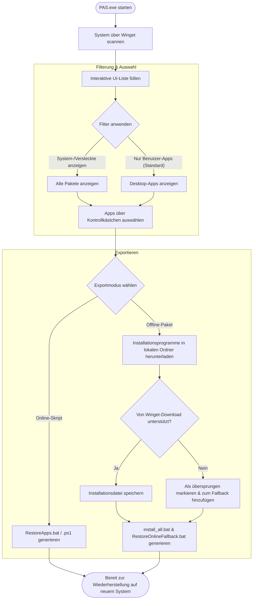

# Benutzerhandbuch für Portable App Sync — Sichern und Wiederherstellen von installierten Windows-Anwendungen

> [!NOTE]
> **Schnellübersicht**
> - Sichern Sie alle installierten Desktop-Programme als kompaktes Skript oder Offline-Paket vor der Neuinstallation von Windows.
> - Stellen Sie Ihr Setup mit einem einzigen Klick über den Windows Package Manager (Winget) wieder her.
> - Die intelligente Filterung blendet Systemdateien, Laufzeitbibliotheken und Abhängigkeiten standardmäßig aus.
> - Automatische Verarbeitung von Programmen ohne direkten Download durch Online-Fallback-Skripte.

---

## Einführung in Portable App Sync

Die Neuinstallation von Windows oder das Einrichten eines neuen PCs ist oft ein mühsamer Prozess, da Sie alle Ihre Anwendungen manuell suchen, herunterladen und installieren müssen. **Portable App Sync (PAS)** ist ein kostenloses, leichtgewichtiges und tragbares Dienstprogramm zur Automatisierung der Sicherung und Wiederherstellung von Windows-Anwendungen. Unter Nutzung des offiziellen Microsoft Windows Package Manager (Winget) hilft Ihnen PAS, Ihr System zu scannen, unnötige Bibliotheken herauszufiltern und Ihre Anwendungsliste in ausführbare Skripte oder hybride Offline-Installationsprogramme zu exportieren. Mit PAS sparen Sie Stunden bei der Systemeinrichtung und stellen sicher, dass Ihr neues System genau die Programme enthält, die Sie benötigen.

### Anwendungs-Workflow

Das folgende Diagramm zeigt den allgemeinen Ablauf beim Sichern und Wiederherstellen Ihrer Anwendungen mit PAS:

---

## Wichtige Funktionen und Fähigkeiten

### Anwendungserkennung und Systemscan
Beim Start führt Portable App Sync einen schnellen systemweiten Scan durch, um alle installierte Software zu erkennen. Die Anwendung lädt den offiziellen Namen, die Paket-ID (Package ID) und Beschreibungen im Hintergrund.

### Intelligentes Filtersystem
Um Ihr Backup sauber zu halten, PAS unterscheidet zwischen benutzerinstallierten Programmen und System-Overhead:
- **Benutzer-Desktopanwendungen**: Ihre Hauptsoftware wie Browser, Editoren und Player.
- **Microsoft Store Apps**: Vorinstallierte UWP/MSIX-Pakete (Xbox, Rechner, Fotos), die normalerweise vom Systemkonto verwaltet werden.
- **Systemkomponenten und Laufzeiten**: Treiber, SDKs und Visual C++-Laufzeiten, die in der Regel automatisch neu installiert oder mitgeliefert werden.
- **Technische Abhängigkeiten**: Framework-Laufzeiten und -Bibliotheken wie `VCLibs` oder `WindowsAppRuntime`.

### Mehrere Exportmodi
- **Online-Skript**: Generiert ein kompaktes Kommandozeilen-Batch- (`.bat`) oder PowerShell-Skript (`.ps1`). Wenn es auf dem neuen System ausgeführt wird, weist es Winget an, die neuesten Versionen Ihrer ausgewählten Programme direkt aus den offiziellen Repositorys herunterzuladen und zu installieren.
- **Offline-Paket**: Lädt die Offline-Installationsprogramme aller kompatibben Anwendungen in ein lokales Verzeichnis herunter. Für Apps, die das direkte Herunterladen einschränken (z. B. Visual Studio Code, Git, Android Studio), weicht PAS automatisch auf ein Online-Backup-Skript aus, wodurch ein hybrides Installations-Set entsteht.

---

## Schritt-für-Schritt-Anleitung zur Einrichtung

Befolgen Sie diese einfachen Schritte, um Ihre Windows-Programme erfolgreich zu sichern und wiederherzustellen:

1. **Schritt 1: Anwendung starten** — Kopieren Sie `PAS.exe` an einen praktischen Ort (z. B. Ihren Desktop oder ein USB-Laufwerk) und führen Sie es aus. Keine Installation erforderlich.
2. **Schritt 2: Anwendungen filtern und auswählen** — Überprüfen Sie die Liste der gescannten Anwendungen. Aktivieren Sie die Kontrollkästchen neben der Software, die Sie sichern möchten. Wenn Sie Systemlaufzeiten oder Store-Apps benötigen, aktivieren Sie die Option **"System und versteckte Anwendungen anzeigen"**.
3. **Schritt 3: Exportmodus auswählen** — Wählen Sie zwischen **Online-Skript** (leichtgewichtig, erfordert Internet während der Wiederherstellung) oder **Offline-Paket** (lädt Installationsdateien lokal herunter).
4. **Schritt 4: Sicherung exportieren** — Klicken Sie auf die Export-Schaltfläche, wählen Sie das Verzeichnis aus, in dem das Backup gespeichert werden soll, und warten Sie, bis der Vorgang abgeschlossen ist.
5. **Schritt 5: Wiederherstellung auf dem neuen System ausführen** — Kopieren Sie die exportierten Dateien auf den Zielcomputer. Klicken Sie mit der rechten Maustaste auf das Wiederherstellungsskript (z. B. `RestoreApps.bat` oder `install_all.bat`) und wählen Sie **"Als Administrator ausführen"**, um die automatische Installation zu starten.

---

## Tastenkombinationen und Tipps zur Bedienung

Obwohl Portable App Sync über eine übersichtliche grafische Benutzeroberfläche verfügt, können Sie sich darin mithilfe der standardmäßigen Windows-Tastatursteuerung leicht bewegen:

| Tastenkombination / Befehl | Aktion / Zweck |
| --- | --- |
| `Tab` | Verschieben Sie den Tastaturfokus zwischen Suchleisten, der Anwendungstabelle, Filtern und Export-Schaltflächen. |
| `Leertaste` | Aktivieren oder deaktivieren Sie das Kontrollkästchen der aktuell fokussierten Anwendung. |
| `Pfeiltaste oben / unten` | Navigieren Sie durch die Tabellenliste der gescannten Desktop-Anwendungen. |
| `Alt + F4` | Schließen Sie die Portable App Sync-Anwendung sofort. |
| `Eingabetaste` | Aktivieren Sie die ausgewählte Filterschaltfläche oder führen Sie den Exportbefehl aus. |

### Profi-Tipps für mehr Effizienz
- **Spaltensortierung**: Klicken Sie auf einen beliebigen Spaltenkopf (wie Name, Quelle oder Paket-ID), um die Liste zu sortieren und bestimmte Tools schnell zu finden.
- **Suchfilterung**: Tippen Sie in das Suchfeld oben, um Programme sofort nach Name oder Paket-ID zu filtern.
- **Administrator-Ausführung**: Führen Sie Ihre exportierten Wiederherstellungsskripte immer als Administrator aus, um zu verhindern, dass Installationsprogramme von Drittanbietern nachfragen oder aufgrund fehlender Rechte fehlschlagen.

---

## Häufig gestellte Fragen und Fehlerbehebung

### Was soll ich tun, wenn Winget auf dem Zielcomputer fehlt?
Winget ist standardmäßig in Windows 11 und neueren Builds von Windows 10 enthalten. Wenn es fehlt, warnt Sie das Wiederherstellungsskript automatisch. Um es manuell zu installieren, öffnen Sie den Microsoft Store, suchen Sie nach **"App-Installer"** und aktualisieren Sie ihn. Laden Sie alternativ das neueste Paket aus dem offiziellen [GitHub-Repository](https://github.com/microsoft/winget-cli/releases) herunter.

### Warum werden einige Anwendungen beim Export des Offline-Pakets übersprungen?
Einige Softwarehersteller (wie Microsoft für Visual Studio Code, Git oder Google für Android Studio) untersagen das direkte Herunterladen ihrer Installationsprogramme über die Winget-API. Wenn dies geschieht, überspringt PAS das Herunterladen und fügt sie zu `RestoreOnlineFallback.bat` hinzu. Führen Sie zur Wiederherstellung zuerst `install_all.bat` aus, stellen Sie eine Internetverbindung her und führen Sie dann `RestoreOnlineFallback.bat` aus.

### Warum schlägt das Wiederherstellungsskript fehl oder bittet um Erlaubnis?
Die meisten Standard-Windows-Anwendungen schreiben Dateien in `C:\Program Files` und registrieren Systemdienste, was lokale Administratorrechte erfordert. Stellen Sie sicher, dass Sie mit der rechten Maustaste auf das Skript klicken und **"Als Administrator ausführen"** wählen.

### Wo kann ich Protokolldateien einsehen, wenn ein Export fehlschlägt?
Portable App Sync protokolliert alle Hintergrundoperationen in einer Textdatei. Sie können sie öffnen, indem Sie `%LocalAppData%\PAS\PAS.log` in die Adressleiste des Windows-Explorers einfügen. Die Datei wird automatisch rotiert, wenn sie 5 MB überschreitet.
