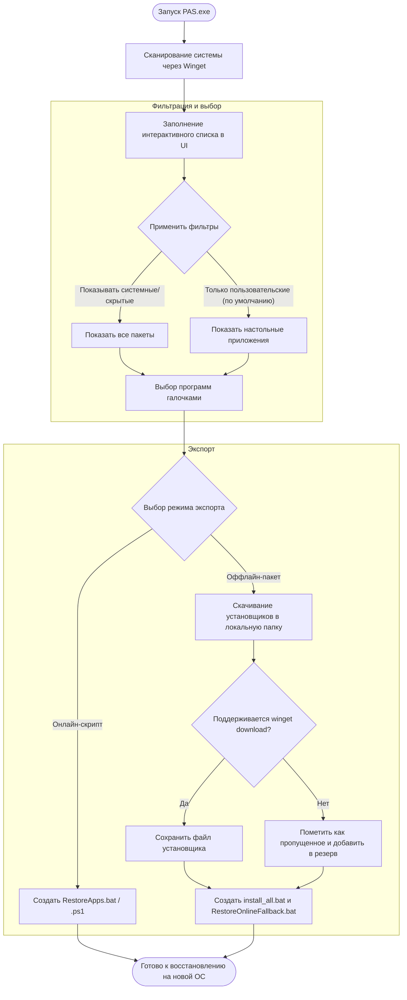

# Руководство пользователя Portable App Sync — как сделать бэкап и восстановить программы на Windows

> [!NOTE]
> **Быстрая выжимка**
> - Создавайте резервные копии всех установленных программ в виде компактного скрипта или оффлайн-пакета перед переустановкой Windows.
> - Восстанавливайте систему в один клик с помощью диспетчера пакетов Windows (Winget).
> - Умная фильтрация по умолчанию скрывает системные файлы, среды выполнения и зависимости.
> - Автоматическая обработка программ без прямой загрузки с помощью резервных онлайн-скриптов.

---

## Введение в Portable App Sync

Переустановка Windows или настройка нового ПК часто превращается в рутинный процесс, так как вам приходится вручную искать, скачивать и устанавливать каждое приложение. **Portable App Sync (PAS)** — это бесплатная, легкая и портативная утилита, созданная для автоматизации резервного копирования и восстановления приложений Windows. Используя официальный диспетчер пакетов Microsoft Windows Package Manager (Winget), PAS помогает сканировать систему, отфильтровывать лишние библиотеки и экспортировать список программ в исполняемые скрипты или гибридные оффлайн-пакеты. Использование PAS экономит часы времени при настройке системы и гарантирует, что на вашем новом ПК будут установлены ровно те программы, которые вам нужны.

### Схема работы приложения

Ниже представлена диаграмма, описывающая процесс резервного копирования и восстановления приложений с помощью PAS:

---

## Ключевые возможности и функции

### Обнаружение и сканирование приложений
При запуске Portable App Sync выполняет быстрое сканирование всей системы для обнаружения установленного программного обеспечения. Утилита в фоновом режиме загружает официальные названия программ, идентификаторы пакетов (Package ID) и описания.

### Система умной фильтрации
Чтобы резервная копия оставалась чистой, PAS разделяет установленные пользователем программы и системные компоненты:
- **Пользовательские настольные приложения**: Ваши основные программы, такие как браузеры, редакторы кода, плееры.
- **Приложения Microsoft Store**: Предустановленные UWP/MSIX пакеты (Xbox, Калькулятор, Фото), которые обычно управляются системной учетной записью.
- **Системные компоненты и среды выполнения**: Драйверы, SDK и библиотеки Visual C++, которые обычно устанавливаются автоматически или идут в комплекте с другими программами.
- **Технические зависимости**: Низкоуровневые среды выполнения системного уровня, такие как `WindowsAppRuntime`.

### Различные режимы экспорта
- **Онлайн-скрипт**: Создает компактный командный файл (`.bat`) или скрипт PowerShell (`.ps1`). При запуске на новой системе он указывает Winget загрузить и установить последние версии выбранных программ из официальных репозиториев.
- **Оффлайн-пакет**: Скачивает автономные установщики всех совместимых приложений в локальную папку. Для программ, которые запрещают прямое скачивание дистрибутивов (например, VS Code, Git, Android Studio), PAS автоматически создает резервный онлайн-скрипт, формируя гибридный набор.

---

## Пошаговая инструкция по настройке

Следуйте этим простым шагам, чтобы успешно создать резервную копию и восстановить программы на Windows:

1. **Шаг 1: Запуск приложения** — Скопируйте файл `PAS.exe` в удобное место (например, на рабочий стол или USB-накопитель) и запустите его. Установка не требуется.
2. **Шаг 2: Фильтрация и выбор программ** — Просмотрите список найденных приложений. Отметьте галочками программы, которые хотите сохранить. Если вам нужны системные библиотеки или приложения Store, включите опцию **"Показывать системные и скрытые приложения"**.
3. **Шаг 3: Выбор режима экспорта** — Выберите между **Онлайн-скриптом** (легковесный вариант, требуется интернет при восстановлении) и **Оффлайн-пакетом** (скачивает файлы установщиков на накопитель).
4. **Шаг 4: Экспорт резервной копии** — Нажмите кнопку экспорта, выберите папку для сохранения и дождитесь завершения операции.
5. **Шаг 5: Восстановление на новой системе** — Перенесите экспортированные файлы на новый компьютер. Щелкните правой кнопкой мыши по скрипту восстановления (например, `RestoreApps.bat` или `install_all.bat`) и выберите **"Запуск от имени администратора"** для начала автоматической установки.

---

## Горячие клавиши и советы по использованию

Несмотря на то, что Portable App Sync имеет простой графический интерфейс, вы можете легко управлять им с клавиатуры, используя стандартные элементы управления Windows:

| Клавиша / Сочетание | Действие / Назначение |
| --- | --- |
| `Tab` | Перемещение фокуса между строкой поиска, таблицей программ, фильтрами и кнопками экспорта. |
| `Space` | Установка или снятие галочки с выбранного в таблице приложения. |
| `Стрелки вверх / вниз` | Навигация по списку найденных в системе приложений. |
| `Alt + F4` | Мгновенное закрытие приложения Portable App Sync. |
| `Enter` | Активация выбранной кнопки фильтра или запуск процесса экспорта. |

### Советы по повышению эффективности
- **Сортировка колонок**: Нажмите на заголовок любого столбца (Имя, Источник или Package ID) для быстрой сортировки списка и поиска нужных утилит.
- **Фильтрация поиска**: Введите текст в поисковую строку вверху для мгновенного отбора программ по названию или Package ID.
- **Запуск от имени администратора**: Всегда запускайте скрипты восстановления от имени Администратора. Это предотвратит сбои установки программ из-за нехватки прав доступа.

---

## Часто задаваемые вопросы и решение проблем

### Что делать, если утилита Winget отсутствует на целевом компьютере?
Winget встроен по умолчанию в Windows 11 и последние сборки Windows 10. Если он отсутствует, скрипт восстановления предупредит вас. Для ручной установки откройте Microsoft Store, найдите **"Установщик приложения"** (App Installer) и обновите его. Также можно скачать установщик напрямую из официального [репозитория на GitHub](https://github.com/microsoft/winget-cli/releases).

### Почему некоторые приложения пропускаются при экспорте оффлайн-пакета?
Некоторые разработчики программного обеспечения (например, Microsoft для VS Code и Git, или Google для Android Studio) запрещают скачивание установщиков напрямую через API Winget. В этом случае PAS пропускает скачивание дистрибутива на диск и добавляет программу в файл `RestoreOnlineFallback.bat`. Для восстановления сначала запустите `install_all.bat`, а после подключения к интернету выполните `RestoreOnlineFallback.bat`.

### Почему скрипт восстановления завершается с ошибкой или запрашивает права доступа?
Большинству настольных программ требуются права администратора для записи файлов в `C:\Program Files` и регистрации системных служб. Убедитесь, что запускаете скрипт через правый клик мыши -> **"Запуск от имени администратора"**.

### Где найти файлы логов в случае сбоя экспорта?
Portable App Sync записывает все операции в текстовый файл. Чтобы открыть его, вставьте путь `%LocalAppData%\PAS\PAS.log` в адресную строку Проводника Windows. Файл автоматически очищается и ротируется при превышении размера 5 МБ.
